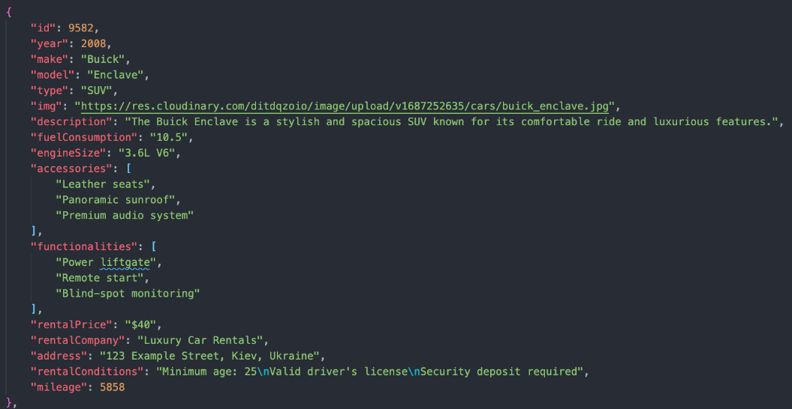

# Car Rental App

## Task Description

Create an application for a company that provides car rental services in Ukraine. The application consists of 3 pages:

1. **Home Page**: It should provide a general description of the services offered by the company. The styling and design are at your discretion.

2. **Catalog Page**: This page should contain a catalog of cars with different specifications. Users should be able to filter cars by brand, hourly rental price, and mileage.

3. **Favorites Page**: This page should display advertisements that the user has added to their favorites.

## Technical Requirements

- Implement the rental card according to the layout.
- The first catalog page should render 8 advertisements, and the rest should load on clicking the "Load more" button.
- Clicking the heart-shaped button on an advertisement card should add it to the favorites list and change the button color.
- When refreshing the page, the user's actions should persist. This means if an advertisement is added to favorites and the page is refreshed, the button should remain in the "favorite advertisement" state with the corresponding color.
- Clicking the heart-shaped button again should remove the advertisement from the favorites list and change the button color back to its initial state.
- Clicking the "Learn more" button should open a modal window with detailed information about the car and its rental conditions.
- The modal window should close when clicking the close button ("x"), clicking the backdrop, or pressing the Esc key.
- The car mileage in the code should be specified as a single value (e.g., 4500). In the UI, it should be displayed with commas (4,500).
- Implement the "Rental car" button as a link that allows the user to contact the company via phone number +380730000000.

## Routing

Implement routing using React Router. The application should have the following routes:

- `/`: Home page with a general description of the company's services.
- `/catalog`: Page containing a catalog of cars with different specifications.
- `/favorites`: Page displaying advertisements that the user has added to their favorites.

If a user visits a non-existent route, they should be redirected to the home page.

## Backend

Create your own backend for development using the UI service [mockapi.io](https://mockapi.io/). Create a resource named `adverts`. Describe the advertisement object as outlined below.

### Advert

Create an advertisement in Mockapi with the following fields: `id`, `year`, `make`, `model`, `type`, `img`, `description`, `fuelConsumption`, `engineSize`, `accessories`, `functionalities`, `rentalPrice`, `rentalCompany`, `address`, `rentalConditions`, `mileage` (see screenshot below). You can use the `adverts.json` file for populating the collection.

You can select the car images on your own.

The database should contain at least 32 advertisements with different values according to your discretion. Pagination should be implemented, with one pagination page containing 8 advertisements.

## Additional Task

Add filtering:

- Dropdown with car brands from `makes.json` - display advertisements with cars of the corresponding brand.
- Dropdown with hourly rental prices (in increments of $10) - display advertisements with cars whose rental price falls within the user-selected price range.
- Group of inputs to determine the mileage range within which the user will search for advertisements.

## Evaluation Criteria

- The layout should be fixed in pixels, semantic, and valid.
- There should be no errors in the browser console.
- Interactivity should work according to the technical requirements.
- The code should be well-formatted and without comments.
- The repository should have a descriptive `README.md`.
- The project should be deployed on GitHub Pages or netlify.com.
